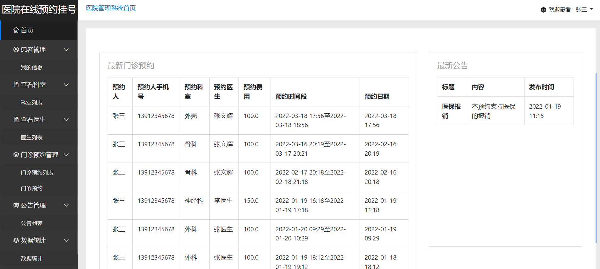
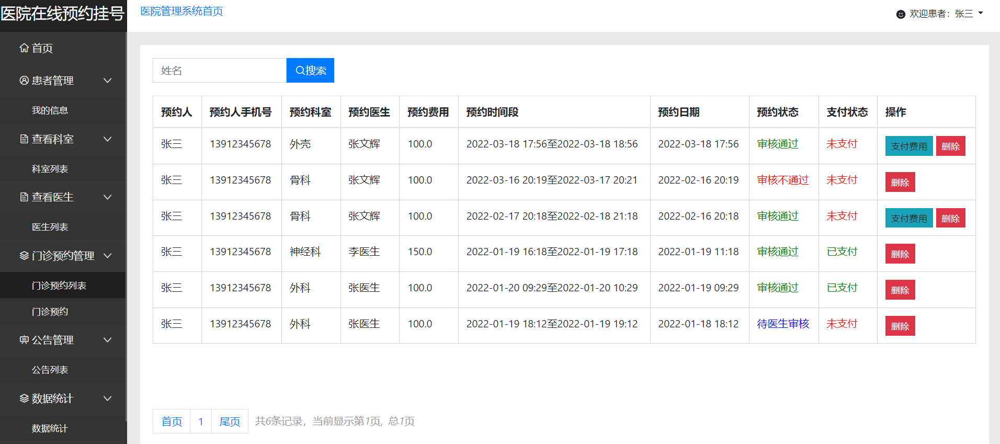
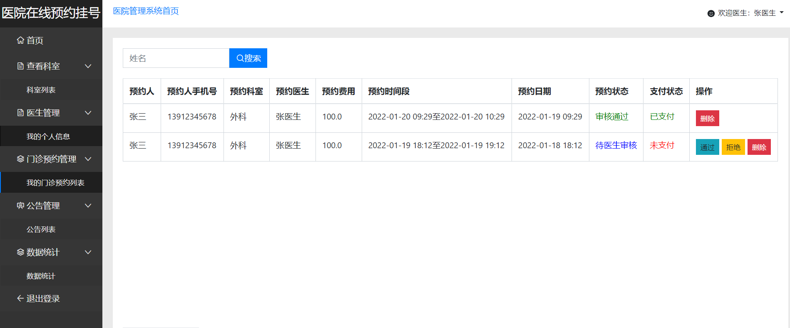
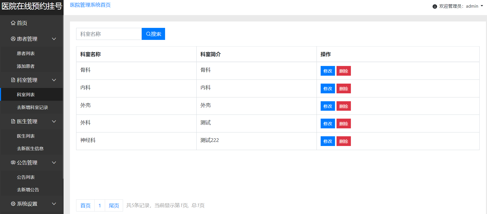
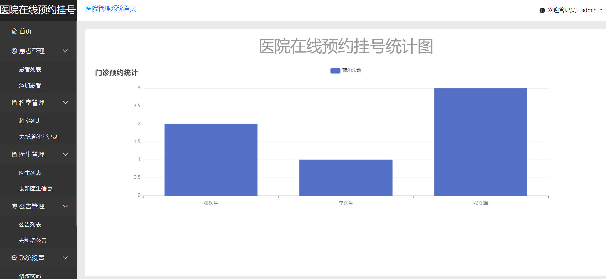

#### 介绍
&emsp;&emsp;医院管理系统，医院预约管理系统，基于SSM的医院管理系统，具体功能如下图所示。

> - 后端技术：Spring+SpringMVC+MyBatis
>
> - 前端技术：Bootstarp
> - 数据库：MySQL
> - 软件：IDEA/Ecilpse
> - **3119403249**

#### 系统展示

&emsp;&emsp;本系统主要分为三个角色，系统管理员、患者、医生。患者登录到本系统可以查看到最新预约情况、对个人信息进行管理、查看医生信息、预约医生、支付医药费、查看通知公告等。医生登录到本系统可以查看到最新预约情况、对个人信息进行管理、查看预约自己的患者、通过或者拒绝预约等。管理员登录到本系统可以查看到最新预约情况、对患者和医生的信息进行管理、发布通知公告、可视化查看本系统的情况。

#### 患者

> 患者首页

> 患者预约

#### 医生

#### 管理员

****

#### 可视化展示

